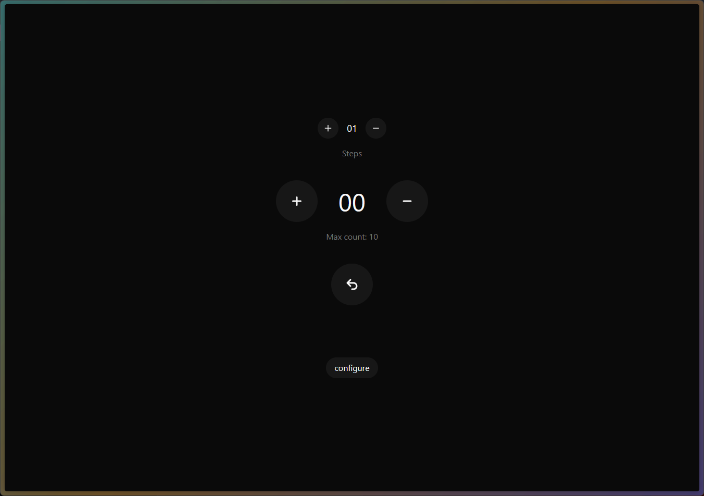

# The Counter App

A simple counter app built with react to test various state management solutions out there.

## Features

- ⬆️⬇️ Increment and decrement counter.
- ⬆️⬇️ Increment and decrement steps.
- 🙂 Reset counter to initial state.
- 🔒 Set max count and delay for operations
- 🧩 **Compare State Management:**
  - The app demonstrates different state management solutions on different routes:
    - **Jotai**
    - **Zustand**
    - **Redux**
    - **effector**
    - **xstate**

